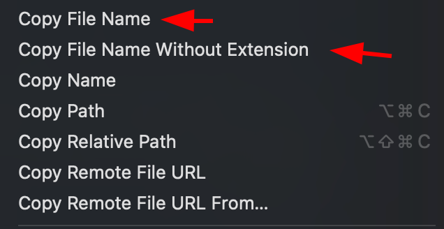

# Copy File Name Only

A Visual Studio Code extension that allows you to quickly copy file names with or without their extensions directly from the explorer context menu.

## Features

- Copy just the file name (with extension)
- Copy file name without extension
- Works from explorer context menu
- Works from editor title context menu

## Usage

Right-click on any file in the explorer or editor tab to access two new options:

1. **Copy File Name** - Copies the complete file name (e.g., "script.js")
2. **Copy File Name Without Extension** - Copies only the name part (e.g., "script")

## Commands

This extension contributes the following commands:

- `copyFilename`: Copy the full file name with extension
- `copyFilenameWithoutExtension`: Copy the file name without its extension

## Installation

1. Open VS Code
2. Open the Extensions view (`Ctrl+Shift+X` or `Cmd+Shift+X`)
3. Search for "Copy File Name Only"
4. Click Install

## Requirements

- VS Code version 1.67.0 or higher

## Release Notes

### 1.0.6 (Current)
- Initial release
- Added support for copying file names with and without extensions
- Added context menu integration

## Contributing

The source code for this extension is available on [GitHub](https://github.com/meghoshpritam/vscode-copy-file-name). Contributions are welcome!

## License

This extension is licensed under the [MIT License](LICENSE).

## Author

[Pritam Ghosh](https://github.com/meghoshpritam)
